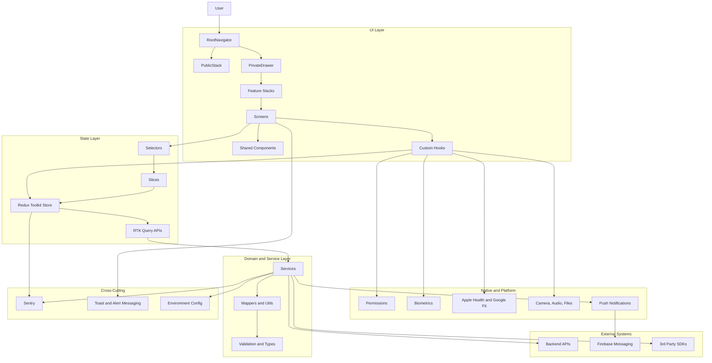
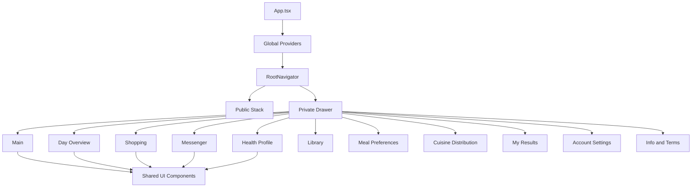
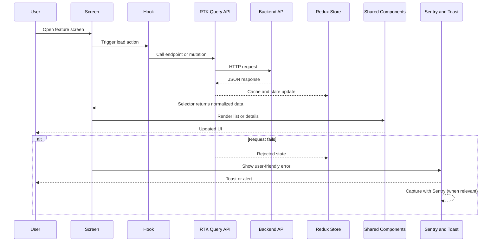

# Intelliceed PatientApp Mobile v2 Architecture

## System Architecture Overview

## Component Hierarchy (High-Level)

## Data Flow (Request and Render)

## Current Architectural Notes

- Async orchestration is based on `Redux Toolkit + RTK Query` (no saga runtime).
- Feature logic is organized around `screens`, `hooks`, `store/api`, `store/slices`, and `services`.
- Native integrations are isolated in service and hook layers where possible.

## Update Checklist

- Reflect newly added feature stacks and screens.
- Keep major `RTK Query` API modules and slice groups up to date.
- Note important architecture decisions directly in this file.
